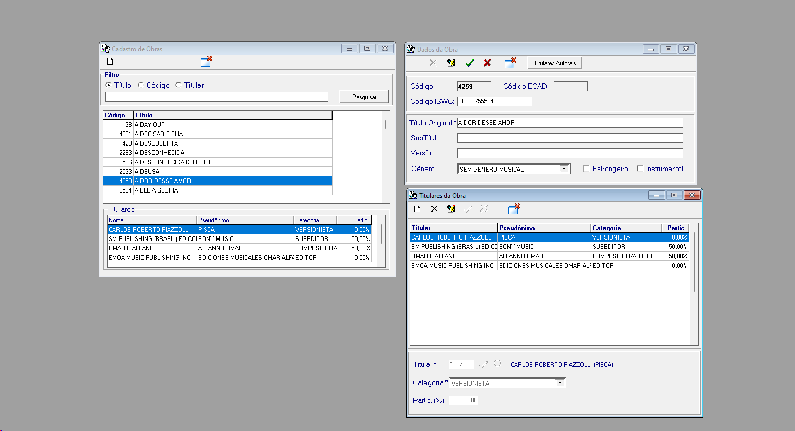

# Tarefas


## Obras
Cadastro das obras

Segue campos que devemos utilizar


* [ ] Criação de um branch obras. https://git-scm.com/docs/git-branch/pt_BR 
* [ ] Criação do app obras.* 
* [ ] Configuração do models com as suas ligações. https://docs.djangoproject.com/en/4.2/topics/db/models/
* [ ] TDD
* [ ] Documentação
* [ ] Configuração do forms. https://docs.djangoproject.com/en/4.2/topics/forms/
* [ ] A adição dos titulares deve ser dinamicas, quer dizer, devemos cadastrar um ou mais titulares. 
* [ ] Tela de cadastro(novo).
* [ ] Tela Delete.
* [ ] Tela alteração.
* [ ] Tela de pesquisa.

### Database - Models

```mermaid
erDiagram
    OBRA }|..|{ TITULAR: Relacao_MuitoParaMuito
 ```
